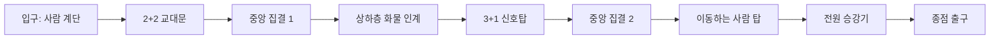

# 넷이서 · 셋이서 협동 업그레이드

검토일: 2026-09-15. 기준 소스: v3.9.2의 넷이서 14판, 셋이서 12판과 공통 엔진.

## 1. 변경 의도와 범위

중심 경험은 **내가 다른 사람의 길이 되고, 그 사람이 돌아와 내 길을 열어 주는 것**이다.
맵을 길게 만들되, 이동거리보다 역할 교대와 협동의 인과관계를 늘린다.
주황버섯의 소개팅에서 사용자가 강조한 사람 계단, 상하층 분리, 구멍, 돌아오는 길을 우선한다.

4장의 장치 가운데 **전원 합류 체크포인트(`c`/`C`) · 시한 우회문(`t`/`T`) · 접이식 구조 사다리(`l`/`L`)** 세 가지는 v3.10.0 에서
공통 엔진에 구현했고, 세 장치를 한 판에 엮은 대표 스테이지 둘 — 넷이서 5-1 「마지막 열차」(환승역), 셋이서 4-1 「약속의 종」(종탑) — 을 추가했다.
나머지 장치와 5·6장의 26판별 개선안은 **아직 기획이다.** 원래 26판의 지형과 풀이 데이터는 유지했다.
그 밖의 소스 변경은 검토 중 재현한 초기화·네트워크·발판 시간 오류 및 검증 도구의 오류를 수정한 것이다(10장).
남은 신규 맵은 아래 클리어 검증 기준을 통과한 뒤 반영한다.

참고 자료:

- [PICO PARK 공식 소개](https://picoparkgame.com/en/pp1/): 인원수에 맞춘 지형, 열쇠와 출구, 다인 협동 기믹을 확인했다.
- [주황버섯의 소개팅 소개](https://logs2.m16tool.xyz/Game/OM150/Main/Main): 함께 목적지까지 이동시키는 게임 개요를 검색 결과로 확인했다.
- 사용자가 준 두 나무위키 본문은 접근되지 않았다. 원작의 개별 스테이지 구조를 직접 확인했다고 전제하지 않는다.

## 2. 현재 구현을 살펴본 결과

| 요소 | 실제 규칙 | 확장할 부분 |
| --- | --- | --- |
| 사람 밟기 | 서 있는 몸 50px + 머리 간격 3px, 웅크린 몸은 더 낮다. 받치는 사람은 점프 불가 | 한 번 올려 주고 끝나는 대신 받침 인원이 전진하는 교대 구간 |
| 이동하는 사람 탑 | 밑사람의 수평 이동을 윗사람이 따라간다 | 탑을 유지하며 이동하고 중간 승강장에서 일부만 내리는 구간 |
| 무거운 상자 | 같은 방향으로 연결된 두 사람이 기차처럼 밀어야 이동 | 운반 담당과 통로 담당을 나누고 다음 방에서 교대 |
| 가벼운 상자 | 혼자 밀기, 낙하, 컨베이어, 포탈, 누름판 대체 가능 | 후발대 구조용 상자로 역할 전환 |
| 누름판 p/q | 사람 또는 상자가 있으면 켜진다 | 현재는 2명 이상·정확히 N명 조건을 직접 표현할 수 없다 |
| 셔터 P/Q | 누름판을 밟는 동안 통과 가능 | 지나간 사람이 반대쪽에서 인계받는 문 |
| 유지형 다리 M/m | 누름판이 켜진 동안만 존재 | 마지막 주자의 도착을 확인한 후 담당 교체 |
| 영구 스위치 a | 모든 A를 열고 모든 n 발판을 켠다 | 스테이지 전체가 하나의 스위치 상태라 독립된 여러 퍼즐 방을 만들기 어렵다 |
| 색 열쇠 r/y/b | 같은 색 블록이 모두 사라진다. 발밑도 없어진다 | 순서 실패 시 복구하는 하부 순환로 |
| 포탈 u/U, w/W | 사람과 상자가 모두 이동한다 | 현재 ‘화물 전용’은 기획 설명이다. 실제로는 사람도 들어가므로 도착 안전망 필요 |
| 사다리 H, 리프트 \| | 세로 통로를 오르내린다 | 리프트도 현재는 사다리 계열 이동이다. 중량 승강기는 새 장치가 필요 |
| 왕복 발판 - | 시간에 따라 자동 왕복, 사람과 상자가 탄다 | 탑승 인원 조건과 두 정거장 구조 |
| 스프링 S | 착지하면 튄다 | 수신자와 발사 담당이 서로 길을 열어 주는 조합 |
| 컨베이어 >/< | 사람과 상자를 옮긴다 | 역방향 회수 장치, 상자 정차 턱 |
| 삭은 발판 v | 접촉 시간 누적 후 사라졌다 복구 | 단독 0.5초 규칙이 되도록 중복 계산 수정 |
| 깜빡 발판 ~ | 2초 켜짐 / 2초 꺼짐 | 장거리 구간은 중간 대피소를 두고 기다림도 전략으로 |
| 통, 가시 | 통은 밀침, 가시는 사망 | 안전한 역할 대기 자리를 통 경로와 분리 |
| 출구 | 전원 도착 또는 한 명 도착 | 한 명 출구에서도 나머지가 마지막 순간까지 할 일이 있도록 구성 |
| 죽음·재시도 | 개인은 시작점 부활, 전원 되감기는 스테이지 초기화 | 긴 맵에선 전원 합류 체크포인트를 별도 설계 |

### 반복되는 문제

1. 미션 후반이 ‘나머지는 기다리고 한 명만 긴 액션 구간’으로 끝나는 판이 있다.
2. 상자가 누름판을 조금 지나치거나 열쇠를 먼저 집으면 전원 처음부터 다시 해야 하는 구간이 많다.
3. 빨강·노랑·파랑과 p/q/a만으로 긴 맵을 확장하면 무관한 구간끼리 작동이 연결된다.
4. 정답을 모르는 첫 플레이의 의논 시간과 실패 복구 시간이 현재 제한시간 설계에 충분히 반영되지 않았다.
5. 검증 봇의 단순화 때문에 ‘해답 존재’, ‘실제 네트워크에서 성공’, ‘처음 하는 사람이 이해 가능’이 구분되지 않았다.

## 3. 설계 기준

- 초반 판은 협동 장면 3~4개, 중반은 5~6개, 후반은 7~9개를 연결한다.
- 후반 첫 클리어 목표는 8~15분, 숙련자는 4~7분. 실제 플레이로 조정할 목표값이다.
- 어려운 동시 조작 사이에는 넓은 합류 공간을 둔다. 한 구간을 이해하고 다음 구간을 논의할 수 있어야 한다.
- 한 명에게만 남는 일은 짧은 절차로 제한한다. 긴 독주가 필요하면 다른 층의 팀원이 계속 경로를 바꾼다.
- 받침이 2명 필요하면 움직일 수 있는 사람은 셋이서 1명, 넷이서 2명이다. 같은 순간의 필수 역할 총합은 정원을 넘지 않는다.
- 한 명이 죽으면 남아 있는 사람이 회수 경로를 열 수 있다. 회수가 불가능하면 그 구간을 함께 초기화한다.
- 누름판 담당자가 떠나는 순서까지 해답에 적는다. ‘건넜다’ 다음에 ‘마지막 담당자는 어떻게 합류하나’가 반드시 있어야 한다.
- 난도는 정보를 숨기는 방식보다 역할 배분·경로 선택·순서·박자에서 만든다.
- 일반 진행은 전체 시간제한을 없애고 필요한 퍼즐 구간에만 시간제 장치를 쓴다. 기록 경쟁은 별도 도전 규칙으로 둔다.

## 4. 추가할 협동 장치

| 장치 | 규칙과 협동 | 실패 복구 / 구현 조건 |
| --- | --- | --- |
| 사람 수 누름판 — **구현** `k`/`K`(둘) · `e`/`E`(셋) | 구역에 서로 다른 생존 플레이어 N명이 있으면 작동. 상자는 세지 않는다 | 순간 스침을 배제하고 0.3초 연속 충족 후 작동. 사람 ID 중복 집계 금지 |
| 탑 높이 감지기 — **구현** `i`/`I` | 바닥에 선 사람부터 연결된 탑의 최상단이 센서에 닿으면 작동 | 공중 점프만으로 켜지지 않게 받침 관계까지 확인. 3인은 2받침+1등반, 4인은 3받침+1등반 |
| 교대문 — **구현** 누름판 `p`·`q` 한 판에 둘까지 | 이쪽 누름판과 반대쪽 누름판 중 하나가 눌리면 열린다 | 건넌 사람이 인계받으면 첫 담당자도 이동 가능. 두 누름판 모두 계속 접근 가능 |
| 접이식 구조 사다리 — **구현** `l`/`L` | 위에 먼저 올라간 사람이 펼치면 아래까지 내려온 채 유지 | 받침팀이 빠져나오는 길. 펼치기 전 아래팀은 안전한 바닥에서 대기 |
| 중량 승강기 — **구현** `V`(둘) · `N`(전원) | 승강장에 N명이 모이면 다음 정거장으로 이동 | 이동 중 이탈 시 즉시 추락하지 않고 정거장으로 복귀. 정원 초과도 안전한 정지 |
| 순서형 발판 릴레이 — 판 설계로 (장치 조합) | 1단계가 2단계를 열고, 2단계가 첫 담당자의 탈출길을 연다 | 한 번에 필요한 역할을 3~4개로 제한. 이전 구간이 봉쇄되기 전에 재합류 보장 |
| 시한 우회문 — **구현** `t`/`T` | 스위치를 누른 뒤 예를 들어 10초간 열린다. 반대편에서 영구 개방 가능 | 문 안에 사람이 있으면 닫힘을 보류하거나 안전한 쪽으로 돌려보낸다. 새 시도는 즉시 가능 |
| 화물 분기기 — **구현** 분기 벨트 `J`(p)·`j`(q) | 한 명이 레일 방향을 정하고 다른 둘이 무거운 상자를 보낸다 | 잘못 보낸 상자는 회수 레일로 돌아온다. 상자 무한 복제 금지 |
| 상자 정차대 — **구현** 누름판 위 상자가 선다 | 누름판 뒤에 턱을 두거나 정차 영역에 들어오면 고정한다 | 미세한 네트워크 지연 때문에 정답 위치를 지나쳐 게임이 막히지 않게 한다 |
| 위아래 인계 — 판 설계로 (장치 조합) | 윗층에서 보낸 상자가 아랫층의 길을 만들고 아랫층은 윗층의 문을 연다 | 낙하 경로에 사람 대기 금지. 회수 상자는 출발대로 돌아온다 |
| 신호탑 — **구현** `z` · `d f g` · `Z` | 한쪽에서만 다음 안전 순서를 볼 수 있고 다른 사람이 실제 경로를 이동 | 기존 말풍선으로 전달 가능하게 3~4가지 신호만 사용. 색뿐 아니라 기호도 함께 표시 |
| 전원 합류 체크포인트 — **구현** `c`/`C` | 모든 참가자가 안전 구역에 모인 뒤 다음 구간을 활성화 | 사람만 옮기지 말고 상자·문·열쇠·시계·포탈·입력·카메라를 함께 저장/복구 |

### 구현한 셋 (v3.10.0)

- **전원 합류 체크포인트 `c`/`C`** — 살아 있는 인원 전원이 집결판 `c` 위에 0.3초 연속으로 서면(상자는 세지 않는다) 집결문 `C` 가 영구히 열리고,
  그 순간 각자의 자리가 체크포인트로 저장된다. 이후 사망하면 시작 자리 대신 자기 집결판에서 부활하고, 부활 화면도 집결 자리를 가운데 둔다.
  되감기(⌥R)와 판 전환은 체크포인트를 지운다.
- **시한 우회문 `t`/`T`** — 스위치 `t` 를 밟으면 문 `T` 가 10초 열린다. 다시 밟으면 10초부터 다시 센다. 시간이 다 됐을 때 문 칸 안에 사람이 있으면 닫힘을 보류한다.
- **접이식 구조 사다리 `l`/`L`** — 레버 `l` 을 밟으면 점선으로만 보이던 `L` 이 사다리가 되어 그대로 남는다. 펼치기 전에는 잡히지 않는다.

세 장치의 상태(`ra`·`cp`·`tm`·`ld`)는 방장이 판정해 판 꾸러미로 전원에게 보낸다. 스테이지 생성기의 검사(`grid.py`), 정적 풀이 검사(`solve.py` 의
`rally`·`timer`·`deploy` 걸음), 실제 엔진 봇(`coop-bot`·`coop-cobot`)이 같은 규칙을 안다. 새 라이브러리도 별도 아키텍처도 들이지 않았다 —
기존 `makeCoop` 의 타일 사전과 `pack/unpack` 확장이다.

### 나머지도 구현 (v3.11.0)

- **사람 수 누름판 `k`/`K`·`e`/`E`** — 서로 다른 사람 둘(`k`)·셋(`e`) 이상이 판 칸들 위에 서 있는 동안 문이 열린다. 사람을 한 번씩만 센다(두 칸에 걸쳐 선 사람도 한 명), 상자는 안 센다. 판에 「2명」「3명」을 쓴다. 혼자 연습할 때는 한 명.
- **교대문** — 새 타일 없이 누름판 `p`·`q` 를 한 판에 둘까지 허용했다. 둘 중 하나만 눌려도 셔터가 열린다.
- **탑 감지기 `i`/`I`** — 몸이 감지기 칸에 닿은 사람의 발밑으로 이어진 사람 사슬(머리 위 3px·가로로 몸 폭 안)이 인원 수 이상이면 켜지고 남는다. 공중 점프로는 안 켜진다.
- **승강기 `V`/`N`** — 기둥 하나가 한 대, 발판은 세 칸 폭. 아래 승강장은 맨 아래 칸 밑 땅과, 위 승강장은 맨 위 칸 줄 양옆 땅과 높이가 같다. `V` 는 둘, `N` 은 전원이 0.3초 서면 오른다. 다 내리고 1.5초 비면 내려온다. 누가 아직 타고 있으면 위에서 기다린다. 오르다 정원이 모자라면 아래 승강장으로 돌아간다. 움직이는 동안은 남의 발이 꾸러미만큼 늦으니 발판 위아래로 넉넉히 센다. 손님은 방장 방향으로 이어 굴리고 꾸러미(`lf`)로 녹여 맞춘다.
- **화물 분기기 `J`/`j`** — 무빙워크인데 누름판 `p`(J)·`q`(j) 가 눌린 동안 오른쪽, 아니면 왼쪽(회수 쪽)으로 돈다. 사람도 상자도 싣는다.
- **상자 정차대** — 밀던 손이 떨어지고 0.3초 지난 상자가 누름판 `p`·`q` 칸에 있으면 판 가운데로 자리 잡고, 벨트도 더 싣지 않는다. 누름판을 **지나가게** 미는 중에는 서지 않는다.
- **신호탑 `z`·`d f g`·`Z`** — 방장이 판을 열 때 세 모양 중 하나를 고르고 꾸러미(`sg`)로 보낸다. 버튼은 `⌥↓`(웅크리기)로 누르고, 누른 채로는 한 번뿐. 틀리면 다른 모양으로 바뀌고 1초 안 먹는다. 모양과 색을 둘 다 그린다.
- **집결판 무리** — 두 칸 안 틈으로 이어진 `c` 들이 한 무리. 무리마다 한 번씩 체크포인트가 되어, 긴 판에서 체크포인트를 앞으로 옮긴다 (꾸러미 `ra` 는 무리 이름 목록).

검사기(`solve.py`)에 `lift`·`tower`·`signal`·`choose`·`sync` 걸음을, 봇 둘(인형·동시)에 같은 걸음과 분기 벨트를 넣었다. 동시 봇을 사람 충돌을 켠 채 굴리며
엔진이 아닌 봇의 약점을 여럿 고쳤다 — 탑을 쌓을 때 자리 순서대로 줄 세우기, 머리 위에서 내려서기, 떨어지는 상자에서 손 떼기, 14px 턱은 걷기, 목표가 앞이면 동료를 뛰어넘지 않기.

## 5. 넷이서 14판 개선안

| 판 / 현재 크기 | 현재 중심 | 추가할 장면과 역할 교대 | 클리어·복구 조건 |
| --- | --- | --- | --- |
| 1-1 표지판 / 108×22 | 한 명이 다리를 지키고 셋이 위로 돌아옴 | 첫 다리 이후 2인 사람 계단, 위에서 구조 사다리를 내리면 첫 담당자가 다음 구간의 선두 | 처음엔 가시 대신 하부 돌아오는 길. 전원 출구 |
| 1-2 상자 계단 / 36×22 | 세 상자의 다른 용도 | 첫 상자는 발판, 두 번째는 담당자 대체, 무거운 세 번째는 상층으로 보내는 화물 | 누름판 뒤 정차 턱. 사람이 상자 반대편으로 돌아갈 통로 유지 |
| 1-3 두 열쇠 / 56×22 | 3인 받침과 열쇠 릴레이 | 3받침+1등반 후, 올라간 사람이 사다리를 내리고 이전 받침 한 명이 다음 열쇠 담당 | 열쇠를 먼저 집어도 하부에서 재진입 가능한 길 |
| 1-4 지키는 사람 / 108×22 | 둘이 누름판, 한 명 받침, 한 명 주자 | 두 누름판을 교대문으로 전환. 마지막 주자는 짧은 셔터만 통과하고 세 동료가 마지막 신호 유지 | 2+1+1 역할. 주자 사망 시 시작 방으로 회수, 나머지 대기석 안전 |
| 2-1 두 길 / 120×22 | 윗층 열쇠, 아랫층 상자 | 상하층에서 서로 상대 문을 여는 두 차례 왕복 인계. 중앙 회랑에서 2명씩 팀 교환 | 상층 열쇠 순서 실패는 중앙 회랑으로 낙하, 영구 고립 없음 |
| 2-2 엘리베이터 / 44×44 | 층별 리프트·상자·스위치 | 2명 탑승 승강기와 각 층 구조 레버. A/B가 오르면 C/D가 중간층 길 개방, 다음엔 역전 | 모든 승강장에 회수 버튼, 빈 승강기도 호출 가능 |
| 2-3 움직이는 발판 / 120×22 | 왕복 발판과 스프링 | 왕복 발판 중간 안전섬, 한 명이 섬에서 후발대 도착 시점을 조절 | 네 명을 한 작은 발판에 억지로 겹치지 않게 2회 수송 |
| 2-4 되돌아오기 / 132×22 | 끝에서 출발점으로 귀환 | 왕로는 상층 교대문, 귀로는 열린 하층. 귀환 때 상자를 뒤에 남은 담당자에게 운반 | 끝 지점 전원 체크포인트, 귀환 실패로 왕로 전체를 다시 하지 않음 |
| 3-1 탑 / 36×60 | 5층 지그재그 상승 | 2개 층마다 집결. 사다리 내리기 → 사람 탑 센서 → 승강기에서 순차 하차 | 낙하 시 직전 중간층으로, 출발 바닥까지 낙하하지 않음 |
| 3-2 3층 창고 / 120×28 | 상자를 다른 층으로 낙하 | 1명 화물 분기, 2명 무거운 상자 운반, 1명 수신 확인. 두 번째 화물에서는 전원 역할 교환 | 상자 회수 레일, 사람 포탈 도착에도 안전 바닥 |
| 3-3 동시에 / 120×22 | 2명 누름판+2명 돌파 | 2+2로 갈린 뒤 반대편 누름판을 인계, 마지막엔 네 사람의 위치 조합으로 출구 개방 | 발판 유지 시간을 여유 있게 주고 문 안에서 닫히지 않게 함 |
| 3-4 옥상 / 132×28 | 열쇠로 상자를 떨어뜨림 | 옥상과 지상에서 각자 다른 구조물을 제어. 탑승 승강기로 다시 모인 뒤 4인 센서 | 열쇠 획득 전 상자 착지 공간 확보. 중간층 체크포인트 |
| 4-1 무빙워크 / 132×22 | 컨베이어+포탈 연쇄 | 진행 방향 분기와 상자 회수, 후반에 이동하는 사람 탑으로 높은 센서 접근 | 잘못 보낸 화물은 출발 레일로. 점멸 다리 중간 대피석 |
| 4-2 종점 / 132×28 | 3층 화물이 1층 문을 열기 | 아래의 대표 긴 스테이지로 확장. 2+2 → 3+1 → 1+2+1 → 전원 탑승 | 구간 3·6 뒤 체크포인트, 전원 출구 |

### v3.11 구현 결과 — 열다섯 판 전부 다시 짰다

위 표의 방향대로 짰다. **판 전체 시간 제한은 모두 없앴다** (박자는 10초 시한문·깜빡이 발판으로). 「지키는 사람」만 한 명 출구로 남겼다 —
셋이 지켜 한 명을 보내는 것이 그 판의 끝 장면이다. 판마다 칸 검사 · 인형 세상 · 참가자별 독립 세상 동시 봇 · 사람 충돌 켬 ·
사람 충돌 켬 + 편도 5프레임(83ms) 다섯 가지를 모두 통과했다.

| 판 | 크기 (전 → 후) | 협동의 줄기 |
| --- | --- | --- |
| 1-1 표지판 | 108×22 → 72×22 | 지키던 사람을 올라간 사람이 데려온다 — 누름판 다리, 두 사람 계단, 구조 사다리가 헛간과 굴 양쪽에 동시에 내려온다 |
| 1-2 상자 계단 | 36×22 → 56×22 | 상자 셋이 사람을 대신한다 — 딛는 상자, 누름판을 넘겨받는 상자, 둘이 포탈로 올려 보내는 화물(정차대) |
| 1-3 두 열쇠 | 56×22 → 64×22 | 넷이 쌓은 탑이 문을 연다 — 받쳐 준 사람이 다음 열쇠를 맡고, 발밑이 사라져도 굴에서 다시 오른다 |
| 1-4 지키는 사람 | 108×22 → 72×22 | 지키는 사람도 결국 건너온다 — 문 양쪽 누름판을 넘겨받고(교대문), 둘·셋이 밟는 판, 마지막엔 셋이 지켜 한 명을 보낸다 |
| 2-1 두 길 | 120×22 → 120×22 | 위층과 아래층이 서로의 문을 두 번씩 열어 주고, 강당 교대문에서 둘씩 층을 맞바꾼다 |
| 2-2 엘리베이터 | 44×44 → 48×46 | 둘이 타야 오르는 승강기 셋 — 먼저 오른 둘은 아래 둘이 길을 열어 줘야 나가고, 다음 층에선 순서가 뒤집힌다 |
| 2-3 움직이는 발판 | 120×22 → 128×22 | 왕복 발판은 한 번에 한 명 — 떠나는 쪽과 닿는 쪽 누름판이 문을 번갈아 지키고, 안전섬에서 모였다 갈아탄다 |
| 2-4 되돌아오기 | 132×22 → 132×22 | 갈 때는 2층 교대문, 올 때는 열린 1층 — 뒤에 남은 담당자에게 상자를 보내 데려온다 |
| 3-1 탑 | 36×60 → 44×64 | 사람 계단 → 구조 사다리 → 집결 → 넷이 쌓는 탑 → 둘 승강기 두 번(층을 건너 교대) → 전원 승강기 → 옥상 어깨 |
| 3-2 3층 창고 | 120×28 → 144×32 | 분기 레버 한 명 · 무거운 화물 둘 · 수신 한 명 → 정차대가 레버를 대신 → 집결 → 둘째 화물은 역할 교환 |
| 3-3 동시에 | 120×22 → 122×22 | 둘 승강기로 2+2 → 두 레인 사이 교대문 → 레인끼리 서로의 벽을 연다 → 두 레인 둘 누름판 인계 → 집결 → 셋이 밟는 마지막 문 |
| 3-4 옥상 | 132×28 → 116×34 | 옥상 둘·지상 둘이 서로의 다리·셔터·사다리를 연다 → 크레인 상자가 누름판을 넘겨받는다 → 중간층 집결 → 전원 승강기 → 넷 탑 |
| 4-1 무빙워크 | 132×22 → 150×26 | 둘이 개찰구를 잡아 주고 교대 → 조종실이 벨트 방향을 정하면 둘이 화물을 싣는다 → 셋이 문을 잡고 한 명이 구조 사다리 |
| 4-2 종점 | 132×28 → 150×36 | 2+2(둘 승강기·층을 건넌 둘 누름판) → 집결 → 셋이 사람 계단으로 한 명을 레버에 → 1+2+1 화물 분기 → 집결② → 넷 탑 → 넷이 타는 승강기 |
| 5-1 마지막 열차 | 144×36 → 144×36 | 발전기 → 어깨 → 스위치 계단 → 집결 → 10초 릴레이 → 구조 사다리 → 화물 분기 → 넷이 타는 승강기 → 셋이 받친 신호탑 → 집결 → 넷 탑 |

## 6. 셋이서 12판 개선안

| 판 / 현재 크기 | 현재 중심 | 추가할 장면과 역할 교대 | 클리어·복구 조건 |
| --- | --- | --- | --- |
| 1-1 정문 / 72×22 | 상자와 1명 받침 | A가 B를 올리고 B가 C의 길을 열며 C가 A의 귀환 사다리를 내림 | 세 명이 각자 한 번 길을 연다. 첫 판은 전원 대기 가능한 넓은 단 |
| 1-2 범퍼카 / 84×22 | 컨베이어 상자와 누름판 | A는 분기, B/C는 운반. 상자가 첫 누름판을 대신하면 A가 다음 구간 선두 | 구멍으로 간 상자는 회수 벨트. 일방 유실 없음 |
| 1-3 관람차 / 36×48 | 세로 왕복과 상자 대체 | 두 명이 승강기를 태우고 한 명이 위층에서 중간 정거장을 개방 | 아래층에 남은 사람이 빈 승강기를 호출할 수 있음 |
| 1-4 유령열차 / 108×22 | 무거운 상자+2받침 | A/B가 C를 올린 뒤 C가 시한 우회문, B가 반대편에서 영구 개방 | 3명으로 2받침과 누름판을 동시에 요구하지 않는다 |
| 2-1 현관 홀 / 96×22 | 2받침과 열쇠 순서 | 윗사람이 아래 2명의 상자 경로를 바꾸고, 상자가 다시 윗사람의 길을 만듦 | 먼저 집은 열쇠가 지우는 바닥 아래에 복귀 통로 |
| 2-2 서재 / 100×28 | 화물 포탈 | 포탈 사람 도착점에 비상 발판과 복귀 사다리, 이후 위아래 화물 인계 | 화물 전용이라는 글에 의존하지 않고 사람 진입도 복구 가능 |
| 2-3 지하실 / 80×22 | 2명 대기+1명 독주 | 두 담당자의 작동 순서가 주자의 길을 번갈아 열도록 변경, 중간 안전실에서 역할 회전 | 한 번에 둘만 담당, 주자는 도움 없이 장거리 독주하지 않음 |
| 2-4 무도회장 / 120×28 | 누름판→어깨→스위치→열쇠 | 3개 방에서 A/B/C가 주자를 한 번씩 맡는 순환 릴레이 | 각 방의 마지막 스위치가 앞 방 담당자의 합류길을 영구 개방 |
| 3-1 컨테이너 야적장 / 120×22 | 2명 운반+1명 열쇠 | 움직이는 화물의 정차 위치를 세 번째가 고른 뒤 운반자 중 한 명이 다음 조종 담당 | 상자 정차대, 모든 레버는 상자 없어도 접근 가능 |
| 3-2 크레인 / 44×38 | 한 명 누름판+둘이 화물 | 2인 탑승과 1인 지상 조작을 층마다 교체. 꼭대기에서 조작자 구조 | 승강기 정거장 안전 폭과 왕복 호출 경로 확보 |
| 3-3 방파제 / 108×22 | 2받침 후 1명 독주 | 둘이 올린 사람이 다리를 내리고 셋이 다시 모여 마지막 경로 개방 | 고립 가시밭을 하부 구조길로 바꾸고 전원 출구로 변경 |
| 3-4 등대 / 132×28 | 마지막 사람이 둘을 구조 | 아래 대표 3인 긴 스테이지로 확장. 운반·받침·등반 역할을 한 바퀴 돌림 | 위층 실패 시 중층 집결, 전원 출구 |

### v3.11 구현 결과 — 열세 판 전부 다시 짰다

위 표의 방향대로 짰다. 열세 판 모두 **전원 출구**이고 **판 전체 시간 제한은 없다** (박자는 10초 시한문·깜빡이 발판으로).
판마다 칸 검사(`run.py`) · 인형 세상(`coop-play`) · 참가자별 독립 세상 동시 봇 · 사람 충돌 켬 · 사람 충돌 켬 + 편도 5프레임(83ms)
다섯 가지를 모두 통과했다. 무도회장은 신호가 판마다 무작위라 열두 번 돌려 열두 번 통과를 확인했다.

| 판 | 크기 (전 → 후) | 협동의 줄기 | 새 장치 |
| --- | --- | --- | --- |
| 1-1 정문 | 72×22 → 64×22 | 셋이 한 번씩 남의 길을 연다 — 어깨로 올리고, 스위치로 다리를 내리고, 레버로 사다리를 내린다 | 구조 사다리 |
| 1-2 범퍼카 | 84×22 → 70×22 | 한 명이 분기를 잡고 둘이 싣는다. 범퍼카가 누름판을 대신하면 풀려난 사람이 앞장서 다음 누름판을 맡는다 | 분기 벨트 |
| 1-3 관람차 | 36×48 → 36×34 | 곤돌라는 둘이 타야 뜬다. 셋째는 누름판을 지키고, 올라간 하나가 사다리를 내리고, 다른 하나는 내려가 셋째와 탄다 | 둘 승강기 · 구조 사다리 |
| 1-4 유령열차 | 108×22 → 110×22 | 둘이 밟아야 열리는 점검문, 어깨로 올린 한 명이 여는 시한 우회문, 그 문을 지난 한 명이 여는 영구 셔터 | 둘 누름판 · 시한문 · 구조 사다리 · 집결 |
| 2-1 현관 홀 | 96×22 → 112×22 | 위 사람의 누름판이 아래 둘의 벨트와 계단이 되고, 아래 둘의 상자가 위 사람의 다리가 된다. 끝은 셋이 쌓는 탑 | 분기 벨트 · 둘 누름판 · 탑 감지기 · 집결 |
| 2-2 서재 | 100×28 → 118×28 | 아래로 보낸 화물이 위층 문을 연다. 사람이 포탈에 잘못 들어가도 바닥과 사다리가 받아 준다 | 분기 벨트 · 둘 누름판 · 구조 사다리 |
| 2-3 지하실 | 80×22 → 112×22 | 두 담당이 밸브를 번갈아 밟고 떼며 주자에게 한 칸씩 열고, 안전실에서 역할이 돈다. **한 명 출구 → 전원 출구** | 집결 · 구조 사다리 |
| 2-4 무도회장 | 120×28 → 120×28 | 세 층의 세 방에서 셋이 한 번씩 달린다. 한 방의 담당이 45칸 떨어진 신호탑을 읽어 주자에게 전한다 | 신호탑 · 구조 사다리 |
| 3-1 컨테이너 야적장 | 120×22 → 128×22 | 조종석의 한 명이 벨트 방향을 잡고 둘이 싣는다. 정차대에 선 컨테이너가 조종석 일을 넘겨받는다 | 분기 벨트 둘 · 정차대 · 둘 누름판 · 시한문 · 집결 |
| 3-2 크레인 | 44×38 → 48×44 | 층마다 둘이 승강기에 타고 한 명이 조작한다. 조작하는 사람이 층마다 바뀐다 | 둘 승강기 셋 · 시한문 · 구조 사다리 · 집결 |
| 3-3 방파제 | 108×22 → 140×24 | 둘이 올린 한 명이 도개교를 내려 셋이 다시 모이고, 하부 격실의 둘을 셋째가 꺼낸다. **한 명 출구 → 전원 출구**, 고립 가시밭 → 하부 구조길 | 탑 감지기 · 둘 누름판 · 구조 사다리 · 집결 |
| 3-4 등대 | 132×28 → 80×48 | 운반·조종 → 받침·등반 → 위아래 인계 → 해치 교대 → 집결 → 다시 운반 → 전원 승강기 → 전원 탑. 셋이 한 번씩 등반 주역 | 거의 전부 |
| 4-1 약속의 종 | 120×42 → 150×42 | 종추 → 어깨 둘 → 집결 → 10초 릴레이 → 포탈 → 구조 사다리 → 셋이 쌓는 탑 → 셋이 타는 승강기 → 집결 → 교대문 | 거의 전부 |

## 7. 대표 설계: 넷이서 ‘종점, 마지막 열차’

목표 형태: 가로 약 160칸 × 세로 약 54칸, 지하 수로 / 승강장 / 신호실 / 옥상.
크기와 시간은 초기 설계값이며 실제 엔진에서 튜닝해야 한다.

| 순서 | A | B | C | D | 다음으로 진행하는 조건 |
| --- | --- | --- | --- | --- | --- |
| 1 사람 계단 | 첫 받침 | 중간 받침 | 마지막 받침 | 올라가 구조 사다리 개방 | D가 사다리를 펴면 A/B/C가 올라옴 |
| 2 교대문 | 입구 누름판 | 출구 쪽으로 이동 | B와 함께 다음 단을 넘음 | A 옆 안전 구역 대기 | B가 반대편 누름판 인계, A/D 통과 후 C가 다음 문 개방 |
| 3 집결 | 집결 | 집결 | 집결 | 집결 | 전원 도착 시 체크포인트 1 |
| 4 화물 | 분기 레버 | 무거운 상자 앞 | 무거운 상자 뒤 | 아래층 수신 | D가 수신 후 A의 합류길 개방, 상자는 누름판에 고정 |
| 5 신호탑 | 받침 | 등반 | 받침 | 받침 | B가 신호 개방, A/C/D는 구조 사다리로 합류 |
| 6 집결 | 집결 | 집결 | 집결 | 집결 | 전원 도착 시 체크포인트 2 |
| 7 이동 탑 | 높은 센서 담당 | 하부 이동 | 중간 받침 | 바닥에서 반대편 문 인계 | A가 상부 스위치로 D의 이동길 개방 |
| 8 마지막 수송 | 탑승 | 탑승 | 탑승 | 탑승 | 전원 도착 조건이 0.3초 유지되면 상승, 전원 출구 |

해결 가능성의 논리: 어느 순간에도 필수 역할은 최대 네 개다. 받침을 모두 쓰는 구간에는 별도 누름판 담당을 요구하지 않는다.
누름판 담당이 남는 구간은 반대편 사람이 문을 인계받는다. 상자는 마지막까지 운반하지 않고 그 구간의 누름판에 정차시킨다.
전원 승강기 앞에는 네 사람이 수평으로 설 수 있는 폭과 높이를 확보한다.

안전 장치: 이동 탑 아래에는 낙사 대신 직전 승강장으로 돌아오는 수로를 둔다. 상자가 분기를 잘못 타면 회수 레일로 돌아온다.
전원 체크포인트 전에는 일부만 다음 구간에 갇히지 않도록 출입문을 열어 둔다.

**구현(v3.10.0)**: 위 설계의 축약판이 넷이서 5-1 「마지막 열차」(144×36, 넷 모두)다. 둘이 미는 발전기(`X`)로 셔터 → 어깨로 한 명을 담 너머로 →
스위치 `a` 로 남은 셋의 계단 `n` → 넷이 집결판에서 체크포인트 → 사다리로 2층 신호실 → 삭은 통로·10초 시한문·점멸 통로 → 구조 레버 `l` →
접이식 사다리 `L` 로 전원 하층 승강장의 출구에. 정적 풀이 67걸음, 순차 인형 풀이 통과, 사람 충돌·편도 2프레임 지연을 켠 독립 월드 동시 봇 66초 클리어.
화물 분기기·중량 승강기·신호탑은 아직 없어서 그 구간은 뺐다.

## 8. 대표 설계: 셋이서 ‘등대, 세 사람의 교대’

목표 형태: 가로 약 100칸 × 세로 약 60칸, 좌우 갱도와 중앙 등대.

| 구간 | 역할 배분 | 담당자 회수 |
| --- | --- | --- |
| 항구 화물 | A/B가 무거운 상자, C가 분기 | 상자가 누름판을 대신하면 셋 다 이동 |
| 첫 상승 | A/B가 받침, C가 등반 | C가 구조 사다리를 펼침 |
| 두 번째 상승 | B/C가 누름판, A가 짧은 셔터 통과 | A가 반대편 문 인계, B/C 합류 |
| 중층 휴게실 | 셋 집결 | 체크포인트 1, 앞쪽 낙하 통로 폐쇄 |
| 화물 재사용 | A가 분기, B/C가 운반 | A는 상자가 연 계단으로 합류 |
| 마지막 상승 | A/C가 받침, B가 등반 | B가 모두의 승강기 호출 |
| 신호 점등 | 각자 한 센서, 어느 순서든 가능 | 셋 충족 후 출구 영구 개방, 최상층에서 전원 만남 |

A/B/C가 한 번씩 등반 주역이 된다. 세 명이 전부 받침에 묶이는 상태는 만들지 않는다.
중층 이후의 사망은 중층으로 돌아간다. 상자 회수 버튼은 그 상자로 열리는 문 바깥에 둔다.

**구현(v3.10.0)**: 축약판이 셋이서 4-1 「약속의 종」(120×42, 셋 모두)이다. 둘이 미는 종추(`X`)로 셔터 → 둘의 어깨로 한 명을 종벽 위로 → 스위치로
남은 둘의 계단 → 셋이 집결판에서 체크포인트 → 중층 회랑 → 삭은 통로·10초 시한문·점멸 회랑 → 종탑 포탈로 꼭대기 → 구조 레버 → 접이식 사다리로
셋이 지상 출구에. 정적 풀이 58걸음, 순차 인형 풀이 통과, 사람 충돌·편도 2프레임 지연을 켠 독립 월드 동시 봇 53초 클리어.

## 9. ‘깰 수 있다’를 확인하는 방법

### 역할과 지형

- 각 구간을 초기 상태 / 진행 상태 / 합류 상태 / 실패 상태로 나눈다.
- 누름판 인원 + 받침 인원 + 운반 인원 + 이동 인원의 동시 합계가 정원을 넘지 않는지 확인한다.
- 동료의 도움으로 도착한 위치에서 그 동료를 구할 장치까지 접근 가능한지 확인한다.
- 기존 엔진 기준 단독 점프는 약 2.15칸, 전속력 점프는 약 4.49칸이 관측됐다. 최대치에 맞춘 필수 점프를 피한다.
- 사람 계단은 머리 높이뿐 아니라 뛰어오르는 경로의 천장, 옆사람의 몸, 착지 폭까지 검사한다.
- 필수 상자 유실, 열쇠 순서 역전, 담당자 사망, 마지막 사람이 뒤에 남음에 대해 모두 복구 절차를 적는다.

### 실제 입력 재생

- 정원별 독립 세계를 만들고 실제 `net.pump`와 `handleMessage`를 사용한다.
- 전원 충돌과 통을 켠 상태에서 정답 입력으로 출발점부터 출구까지 성공해야 한다.
- 검증을 위해 사람을 순간이동하거나 움직이지 않는 사람의 죽음을 무시하면 해당 결과는 부분 검증으로 표시한다.
- 편도 0/30/80/150ms, 비대칭 지연, 메시지 처리 지연, 중복·누락을 시험한다.
- 정답 재생뿐 아니라 누름판을 너무 일찍 떠남, 잘못된 열쇠, 상자 과도한 밀기, 담당자 낙사를 시험한다.
- 신규 맵은 단순화된 풀이 검사와 독립 세계의 성공 기록을 모두 남긴다.
- 마지막에는 서로 다른 Mac 3대/4대에서 실제 최초 플레이와 재시작을 확인한다.

## 10. 이번에 수정한 오류

| 심각도 | 재현과 근거 | 변경 |
| --- | --- | --- |
| major | `loadStage`가 전원 위치를 지우지 않아 되감기 직후 옛 팀원 위치가 a 스위치를 켬 | 원격 위치·보간값까지 출발점으로 초기화 |
| major | 이전 판의 좌표·밀기·출구 메시지를 새 판에서 적용할 수 있었음 | 호스트 판 세대 ep와 송신 순서 sq, 이전 세대 요청 거부 |
| major | `go`에는 판 상태가 없어서 같은 판 재시작 시 손님 초기화 상태가 뒤따르는 스냅샷과 달라질 수 있음 | 시작 메시지에 게임 상태 포함, 누락 시 스냅샷으로 참가 복원, 중복 시작 무시 |
| major | `placeAt`이 사망·탑승·포탈 상태를 남김 | 부활·전환 시 해당 상태 초기화, 누적 재시작 횟수 동기화 |
| major | 삭은 발판에 한 명의 양발이 같은 타일로 계산되어 1프레임에 시간이 2번 증가 | 한 사람·한 타일은 프레임당 한 번만 증가 |
| minor | `world.update`와 협동 `move`가 사망 시간을 각각 증가시킴 | 0.8초 부활 시간을 한 곳에서만 증가 |
| major | 각자 위치 중심으로 시작 카메라 생성, 장식 시간은 각 앱 실행 시각 | 공통 출발 구역 중심 카메라, 협동 배경 애니메이션은 공유 판 시계 |
| major | 테스트 프로세스가 결과 없이 종료되면 총 실패 수에 포함하지 않을 수 있음 | 비정상 종료를 실패로 집계 |
| major | 동시 플레이 검사 실패에도 종료 코드 0, 영상 생략 시 통과 판 수와 시간이 0으로 표시 | 실패 종료 코드와 실제 통과 수·프레임 표시 |
| major | 겹친 팀원을 향해 걸으면 사람 충돌 보정이 이전 위치보다 뒤로 이동시킴. 양 게임·양 방향에서 회귀 검사로 재현 | 전진 거리만 줄이고, 벽·상자 내부로 보정하지 않도록 제한 |
| major | 방장이 옮긴 상자 위에 선 손님이 상자를 따라가지 못함 — 손님 쪽 상자는 좌표만 보간하고 직전 좌표를 안 남겨 「상자가 움직였다」를 몰랐다 | 꾸러미로 상자를 옮길 때 직전 좌표를 기록 |
| minor | 시작 카메라를 출발 구역 중심으로 바꾸면서 부활 때마다 그 자리로 튀게 됨 — 집결 체크포인트에서 부활하면 출발 구역이 잠깐 보였다가 끌려옴 | 부활 화면은 체크포인트가 있으면 집결 자리를, 없으면 출발 자리를 가운데 둔다 |
| major | 넷이서·셋이서에서 배구로 갈아 끼우면 네트가 화면 오른쪽 끝(밖)에 그려짐 — 카메라 게임은 world.w 가 판 크기(4536px)라 코트가 그 폭을 물려받았다 | 셸이 화면 크기를 `world.screen` 에 남기고, 게임이 바뀐 프레임에 다시 맞추고, restart 가 그 크기로 되돌린다 |
| major | 지연이 있으면 둘이 밀어도 무거운 상자가 안 움직임 — 방장 화면의 손님 유령이 속도로 이어 그려져 상자를 지나쳐 보이고, 「상자 뒤에 있나」를 그 자리로 재 미는 사람이 빠졌다. 사람이 겪는다 | 밀기를 부탁한 사람은 자리로 거르기 **전에** 보정된 자리로 센다 (`countPushers`) |
| major | 사람 계단에서 가운데 받침이, 밑에서 뛰어오르는 다른 사람 머리에 실려 한 몸 높이 솟았다 떨어짐 — 오르는 사람 화면에선 같은 순간 그 받침이 천장이었다. 두 화면이 딴 일을 겪는다 | 발 위로 솟은 머리는 **지난 프레임에 딛고 있던 사람**의 것만 바닥으로 친다 (`floorBelow` 의 `riseOnly`) |

통신 규약은 11에서 12로 올렸다. 예전 앱과 바뀐 메시지를 섞어 처리하지 않도록 기존 버전 협상에서 구분한다.
같은 빌드끼리 플레이해야 한다. 버전은 v3.10.0.

## 11. 검증 결과와 남은 확인

- 기본 검사와 회귀 검사: `npm test` 전부 통과 — 수치는 `test/결과.md`. 신규 장치 검사(`coop.mjs`: 집결·체크포인트 부활·부활 카메라·시한문·구조 사다리·꾸러미)와
  협동 초기화 검사(`coop-lifecycle.mjs`), 판 열다섯·열셋의 순차 인형 풀이 포함.
- 신규 두 판: `run.py` 정적 풀이 통과, `coop-play` 순차 풀이 통과, `BUMP=1 NOVID=1 node test/coop-cobot.mjs` (사람 충돌 켬, 편도 2프레임, 참가자별 독립 월드)
  넷이서 「마지막 열차」 66초 · 셋이서 「약속의 종」 53초 클리어. 통은 두 판 모두 없다.
- 신규 초기화·충돌 검사 67개: 실제 송수신 함수, 시작 메시지 누락, 과거 요청, 다른 방 입장, 전원 초기화, 26판 시작 카메라, 부활·발판 시간, 실제 출구 입력 전환, 종료 스냅샷, 겹친 동료와의 양방향 충돌.
- 시작 화면을 실제 Canvas 렌더러로 4개 생성했다. 동일한 1512×944 월드 뷰에서 네 카메라 모두 x=231, y=-10으로 일치하고, 각 패널의 비어 있지 않은 픽셀도 확인했다.
- 기존 순차 인형 풀이: 넷이서 14/14, 셋이서 12/12. 통을 제거하고 다른 사람을 단순화한 검사다.
- 수정 전 독립 세계 순차 봇, 편도 50ms: 넷이서 4/14, 셋이서 4/12. 상자 정차 오차, 어깨 조립, 가만히 있는 사람 낙하에서 실패했다.
- 초기 동기화와 종료 판정을 고친 뒤 기존 동시 봇의 기본 설정: 넷이서 12/14, 셋이서 11/12. 기본 설정은 **사람 충돌과 통을 제거**한다. 전체 실제 플레이 성공으로 보고하지 않는다.
- 기본 설정의 실패 판: 넷이서 움직이는 발판·3층 창고, 셋이서 서재.
- 역방향 충돌 보정 수정 전, 사람 충돌을 켠 `BUMP=1 NOVID=1` 검사: 넷이서 2/14, 셋이서 7/12. 통은 여전히 제거한다. 원래 풀이의 동시 실행 일정이 충돌 조건에서 유효하다는 증거가 부족하다.
- 역방향 충돌 보정 수정 후 현관 홀 단독 재검사: 맵 밖 음수 좌표 이탈은 재현되지 않았지만, 13,434프레임에 출구 0/3으로 실패했다. 해당 판의 해결 가능성을 검증한 결과는 아니다.
- 충돌을 켰을 때 넷이서는 지키는 사람·엘리베이터만 성공. 셋이서는 관람차·유령열차·현관 홀·크레인·방파제가 실패했다.
- 확인 필요: 동시 봇의 충돌·대기·포탈 진입 일정과 실제 엔진 문제를 추가로 분리해야 한다. 봇 실패만으로 해당 판이 불가능하다고 단정하지 않는다.
- 확인 필요: 서로 다른 기기에서의 실제 전송, 창 크기 차이, 모니터 변경, 장시간 플레이. 화면 크기가 다르면 보이는 영역은 달라도 월드 좌표·기믹 상태는 일치해야 한다.

현재 결과는 버그가 전혀 없다는 보장이 아니다. 확인된 초기화 오류를 수정하고 검증 범위를 넓힌 상태다.
남은 장치(사람 수 누름판·탑 높이 감지기·교대문·중량 승강기·화물 분기기·상자 정차대·신호탑 등)와 기존 26판의 개선안 구현은
위의 해결 가능성 기준과 실패 복구 설계를 따라 별도로 진행해야 한다.
